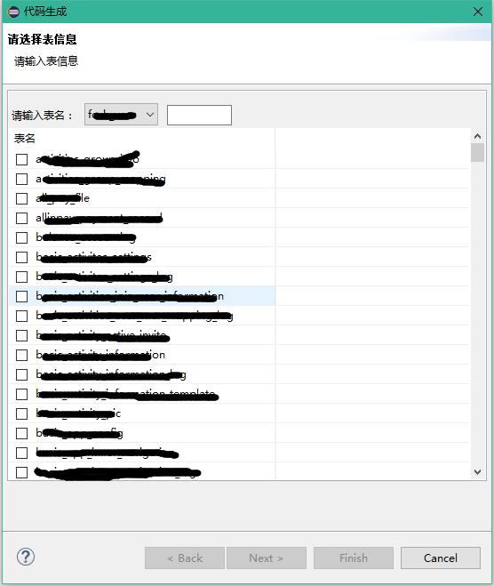

# eclipse_codeGenerator
eclipse_codeGenerator 是一个使用 Freemarker 模板生代码的Eclipse插件。

本生成器只是将数据库中的表结构数据提取出来，然后将这份结构模型提交给模板引擎, 根据你自定义的模板生成你需要的代码。

本项目是在[CodeGenerator](https://www.oschina.net/p/codegenerator)的基础上开发而得。

插件截图	

# 配置文件

		<?xml version="1.0" encoding="UTF-8" ?>
		<generatorConfiguration>
			<properties url="file:///D:/code-gen/conf.properties"/>
			<classPathEntry location="${mysql.jar.path}" />
			
			<jdbcConnection driverClass="${jdbc_driverClassName}"
			connectionURL="${jdbc_url}" userId="${jdbc_username}" password="${jdbc_password}" />
				
			<context name="model">
				<codeGenerator targetPackage="com.zz.zwj.avatar.dao.model" targetProject="codeGeneratorTest" targetFileNameSuffix="Dao.java" template="templates/dao.ftl"/>
				<codeGenerator targetPackage="com.zz.zwj.service" targetProject="codeGeneratorTest" targetFileNameSuffix="Service.java" template="templates/service.ftl" />
				<codeGenerator targetPackage="com.zz.zwj.controller" targetProject="codeGeneratorTest" targetFileNameSuffix="Controller.java" template="templates/controller.ftl"  />
				<codeGenerator targetPackage="mapper" targetProject="codeGeneratorTest/src/main/resources" targetFileNameSuffix="Mapper.xml" template="templates/entity.ftl" />
			</context>
		</generatorConfiguration>
		

说明

  |属性|说明|
  | - | -|
  |properties|属性文件,对配置文件中的${...}中的属性进行替换| 
  |classPathEntry|需要加载的jar包的配置，如JDBC的驱动jar包| 
  |context|代码生成的容器|
  |codeGenerator|代码生成的实际配置|
  
codeGenerator属性说明	
* targetProject		
保存代码的工程。
* targetPackage	
保存代码的包
* template	
freemarker模板
* targetFileNameSuffix	
代码文件的后缀，最终文件名=表名(转换为驼峰型)+targetFileNameSuffix

# 模板中可用的变量

		String       targetPackage       目标包(代码保存的基准路径)
		table 		   对象

## table属性

		String       tableName           表名
		
		String       tableType           表类型
		
		String       tableAlias          表别名
		
		String       remarks             表注释
		
		String       remarksUnicode      表注释转Unicode后的字符串
		
		String       className           实体类名
		
		String       javaProperty        实体类作为属性时的名字 == ${table.className?uncap_first}
		
		List<Column> primaryKeys         主键集
		
		List<Column> baseColumns         基本字段集
		
		List<Column> columns             所有字段  == primaryKeys + baseColumns
		
		List<Key>    importedKeys        所有 importedKeys
		
		List<Key>    exportedKeys        所有 exportedKeys
		
		boolean      hasDateColumn       是否有日期类型字段
		
		boolean      hasBigDecimalColumn 是否有 BigDecimal 字段
		
		boolean      hasNotNullColumn    是否有非空的基本类型字段
		
		boolean      hasNotBlankColumn   是否有非空的 String 字段

## Column属性

		String  columnName        字段名
		
		boolean primaryKey        是否为主键
		
		boolean foreignKey        是否为外键
		
		int     size              字段长度
		
		int     decimalDigits     小数位长度
		
		boolean nullable          是否可空
		
		boolean unique            是否唯一值
		
		boolean indexed           是否有索引
		
		String  defaultValue      默认值
		
		String  remarks           注释
		
		String  remarksUnicode    数字转Unicode后的字符串
		
		int     jdbcType          对应 java.sql.Types
		
		String  jdbcTypeName      对应jdbcType的名称
		
		String  javaProperty      属性名
		
		String  javaType          java类型，比如String
		
		String  fullJavaType      完整的Java类型，比如 java.lang.String
		
		String  getterMethodName  Get方法名
		
		String  setterMethodName  Set方法名

## Key

		String  pkTableName       PKTABLE_NAME
		
		String  pkColumnName      PKCOLUMN_NAME
		
		String  fkTableName       FKTABLE_NAME
		
		String  fkColumnName      FKCOLUMN_NAME
		
		Integer seq               KEY_SEQ